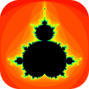

# Fractal Painter Program

This program paints the Mandelbrot set or the Burning Ship set. You can pan around the canvas with the W, A, S, and D keys, as well as zoom with the + and - keys. HJKL and the arrow keys can also be used for navigation. The program uses 64 iterations of the fractal to determine which pixels belong in the set.

