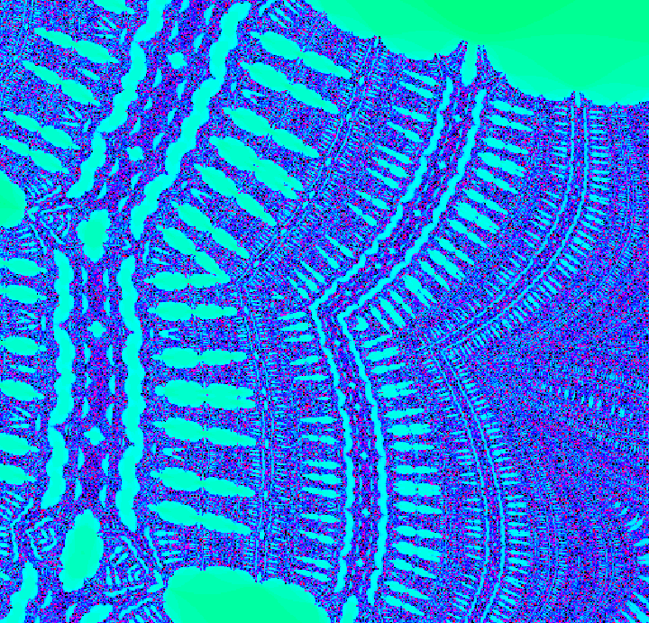

# Fractal Painter Program

This program paints the Mandelbrot set or the Burning Ship set. You can pan around the canvas with the W, A, S, and D keys, as well as zoom with the + and - keys. HJKL and the arrow keys can also be used for navigation. The program uses 64 iterations of the fractal to determine which pixels belong in the set.

# Key Bindings
|Key     | Action |
|--------|--------|
|W, K, Up Arrow | Pan up (along the negative real axis)
|S, J, Down Arrow | Pan down (Along the positive real axis)
|A, H, Left Arrow | Pan left (Along the negative imaginary  axis)
|D, L, Right Arrow| Pan right (Along the positive imaginary axis)
|+ (Plus key)| Zoom in
|- (Minus key)| Zoom out
|Z| Switch between Mandelbrot and Burning Ship sets
|X| Toggle debugging information display
|C| Toggle centerline display
|B| Return home (Reset scaling)
|Q| Print centerpoint to System.out
|M| Print help message to System.out 

